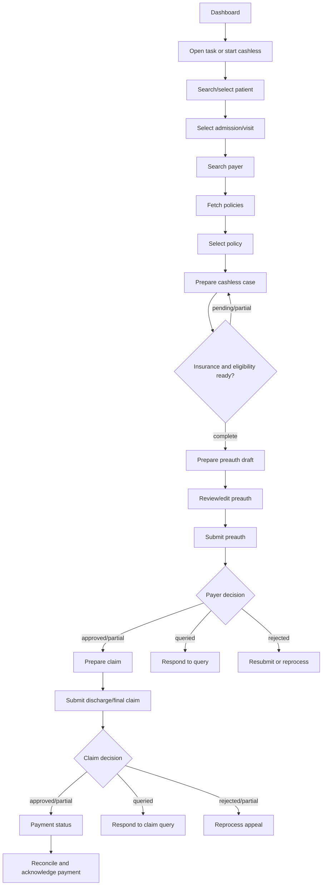

# NHCX Frontend Implementation Guide

This guide translates [FRONTEND_API.yaml](FRONTEND_API.yaml) into a hospital-facing frontend experience. The UI calls only the wrapper API under `/api/v1/insurance`; it never calls NHCX directly.

The product goal is to help billing and insurance desk users move a patient from cashless discovery to preauth, claim submission, reprocess, payment reconciliation, and payer communication handling with the fewest context switches.

## Product Shape

Build the frontend as an operations workspace, not a marketing-style flow. Users need dense information, clear next actions, visible blockers, and fast recovery from payer queries.

Primary areas:

| Area | User Intent | Main APIs |
|---|---|---|
| Dashboard | Know what needs attention today | `GET /cashless/dashboard/stats`, `GET /cashless/dashboard/claims`, `GET /cashless/tasks` |
| Cashless Wizard | Start a cashless workflow for one patient | `GET /cashless/child`, `GET /cashless/payers/search`, `POST /cashless/policies/fetch`, `POST /cashless/prepare` |
| Preauth | Review generated draft, submit, respond, resubmit, cancel | `GET /cashless/preauth/prepare`, `POST /cashless/preauth/*`, `GET /cashless/preauth/status/{correlation_id}` |
| Claims | Submit discharge/final claim and manage payer decisions | `GET /cashless/claims/prepare`, `POST /cashless/claims/*`, `GET /cashless/claims/status/{correlation_id}` |
| Reprocess | Appeal partial approvals or rejections | `POST /cashless/reprocess/submit`, `GET /cashless/reprocess/status/{correlation_id}` |
| Payment | Reconcile payment notices and retry failed acknowledgement | `GET /cashless/payment/status`, `POST /cashless/payment/acknowledge` |
| Tasks | Work payer-generated human tasks | `GET /cashless/tasks`, `GET /cashless/tasks/{task_id}`, `PATCH /cashless/tasks/{task_id}` |
| Communications | Review payer messages | `GET /cashless/communications`, `GET /cashless/communication/status/{correlation_id}` |

## Core Journey



## Information Architecture

Use a left navigation shell with these sections:

| Nav Item | Default View |
|---|---|
| Work Queue | Pending tasks grouped by urgency |
| Cashless Cases | Dashboard claims list with filters |
| New Cashless | Patient search and payer/policy wizard |
| Communications | Payer messages and notices |
| Payments | Payment reconciliation search |

The first screen after login should be **Work Queue**, not a generic dashboard. The claims dashboard is still important, but the highest-value user journey is "what needs action now?"

Every case-focused screen should use the same sticky case header:

| Header Field | Source |
|---|---|
| Patient | `patient.name`, `patient_name`, or `child_name` |
| Child ID | `child_id` |
| Claim ID | `claim_id` or dashboard `id` |
| Admission | `admission_id`, `admission_date`, `discharge_date` |
| Payer | `payer_code` and payer name when available |
| Policy | `policy_number` |
| Preauth | `preauth_ref`, `preauth_status`, latest `preauth_correlation_id` |
| Case Status | `status`, `current_step`, latest decision |

Keep this header visible across eligibility, preauth, claims, reprocess, payment, tasks, and communications when a case is in context. Billing users should never have to remember which patient, payer, or claim they are acting on.

## Shared State

Keep these values in route state or a case-scoped store:

| State | Source | Used By |
|---|---|---|
| `request_id` | Frontend-generated UUID | Optional idempotency/tracing for workflow actions |
| `child_id` | Child search result | Policy fetch, cashless prepare, task filtering |
| `admission_id` | Child visit selection | Policy fetch, cashless prepare, preauth prepare |
| `claim_id` | Dashboard claim, visit claim, or cashless prepare response | Preauth, claims, reprocess, payment lookup |
| `payer_code` | Payer `participant_code` | Policy fetch and optional overrides |
| `policy_number` | Selected policy | Cashless prepare and optional overrides |
| `cashless_case_id` | Cashless prepare response | Cashless status polling and task filtering |
| `eligibility_correlation_id` | Cashless case `coverage_eligibility.correlation_id` | Optional preauth submit override |
| `preauth_correlation_id` | Preauth submit/resubmit/query/cancel response | Preauth status polling |
| `preauth_ref` | Preauth status response or claim draft | Cancel preauth, claim submission |
| `claim_correlation_id` | Discharge/final claim response | Claim status polling |
| `reprocess_correlation_id` | Reprocess submit response | Reprocess status polling |
| `payment_reference` | Payment event | Payment acknowledgement retry |
| `payment_correlation_id` | Payment acknowledgement response | Ack status polling |

Use snake_case field names exactly as shown in `FRONTEND_API.yaml`: `payer_code`, `policy_number`, `force_refresh`, `admission_id`, and `request_id`.

## Case Timeline And Resume Rules

Every cashless case should expose a compact timeline. Use it on the dashboard row expansion, the sticky case header, and every case detail page.

Timeline stages:

| Stage | Done When | Waiting State | Primary Next Action |
|---|---|---|---|
| Patient selected | `child_id` and visit/admission are selected | No visit selected | Select Visit |
| Payer selected | `payer_code` exists | Payer search incomplete | Select Payer |
| Policy selected | `policy_number` exists | Policy fetch pending/empty | Select Policy |
| Eligibility | Cashless case `status` is `complete` | `pending` or `partial` | Refresh / Prepare Preauth |
| Preauth | Preauth `decision` exists | Preauth status `pending` | View Decision / Respond |
| Claim | Claim `decision` exists | Claim status `pending` | View Decision / Respond |
| Reprocess | Reprocess `decision` exists, when applicable | Reprocess status `pending` | View Appeal Decision |
| Payment | Payment event exists | Payment `not_found` | Refresh Payment |
| Acknowledgement | Ack `submitted` or successful | Ack `failed` or `pending` | Retry Acknowledgement |

Resume behavior must be deterministic:

| Current Data | Resume Destination |
|---|---|
| Pending task exists | Open Work Queue detail drawer for that task |
| `payment_reference` exists and ack failed | Payment Reconciliation |
| Claim `decision` is `APPROVED` or `PARTIALLY_APPROVED` | Payment Reconciliation |
| Claim correlation exists and no terminal decision | Claim Decision |
| Preauth `decision` is `APPROVED` or `PARTIALLY_APPROVED` | Claims |
| Preauth `decision` is `QUERIED` or `REJECTED` | Preauth Status And Actions |
| Preauth correlation exists and no terminal decision | Preauth Status And Actions |
| Cashless `next_actions` contains `prepare_preauth` | Preauth Draft |
| Cashless case exists and status is `pending` or `partial` | Eligibility Preparation |
| `policy_number` exists but no cashless case | Eligibility Preparation, ready to submit |
| `payer_code` exists but no `policy_number` | Payer And Policy |
| Only `child_id` exists | Patient And Visit |

On route load, read the latest server state before rendering the main content. Show a compact skeleton in the content area while the sticky header uses the best locally cached identifiers.

## Screen 1: Work Queue

Purpose: give billing staff one place to act on payer callbacks without searching through cases.

API:

```http
GET /api/v1/insurance/cashless/tasks?status=pending&workflow=&limit=20&offset=0
```

Layout:

| Region | Design |
|---|---|
| Top bar | Search by claim ID/patient text, status segmented control, workflow dropdown |
| Summary strip | Counts by urgent/high/normal and by workflow |
| Task list | Dense rows or cards with priority, workflow, task type, title, claim/case context, required documents, age |
| Detail drawer | Opens from a task; shows metadata, required docs, payer notes, and the action form |

Task card content:

| UI Element | Source |
|---|---|
| Priority dot | `priority` |
| Title | `title` |
| Description | `description` |
| Workflow badge | `workflow` |
| Task type chip | `task_type` |
| Required documents | `required_documents[]` |
| Primary button | `action.label` |

Task ordering should be time-aware:

| Priority Signal | UI Treatment |
|---|---|
| `priority: urgent` | Pin to top, red left border, show age in header |
| `priority: high` | Sort above normal, amber marker |
| Age over 2 hours | Show "Waiting 2h+" badge |
| Age over 1 business day | Show "Overdue" badge |
| Payment ack failed | Show retry action inline |
| Missing documents | Show document count as a blocker |

The queue should default to pending tasks sorted by priority first, then age descending. Completed tasks should remain searchable for audit but should not compete visually with pending work.

When the user completes the action, call the endpoint in `task.action`, then mark the task completed:

```http
PATCH /api/v1/insurance/cashless/tasks/{task_id}
Content-Type: application/json

{
  "note": "Response submitted from frontend",
  "metadata": {
    "submitted_correlation_id": "..."
  }
}
```

## Screen 2: Cashless Cases Dashboard

Purpose: let users scan all cashless cases, filter by status, and resume the right workflow.

APIs:

```http
GET /api/v1/insurance/cashless/dashboard/stats
GET /api/v1/insurance/cashless/dashboard/claims?status=&child_id=&limit=20&offset=0
```

Top metric cards:

| Metric | Source |
|---|---|
| Total | `claims.total` |
| Pending | `claims.pending` |
| Partial | `claims.partial` |
| Complete | `claims.complete` |
| Failed | `claims.failed` |
| Preauth Pending | `claims.preauth_pending` |
| Children With Claims | `children.with_claims` |

Claims table columns:

| Column | Source |
|---|---|
| Patient | `patient_name` or `child_name` |
| Claim | `id` |
| Use Type | `use_type` |
| Workflow Status | `status` |
| Decision | `claim_decision` |
| Approved Amount | `approved_amount` |
| Payment | `payment_status` |
| UTR | `latest_utr` |
| Created | `created_at` |

Row actions should be contextual:

| Condition | Action |
|---|---|
| Missing policy/preparation | Resume Cashless Setup |
| Preauth pending | View Preauth Status |
| Claim queried | Open Query Task |
| Claim approved/partial | View Payment Status |
| Payment ack failed | Retry Acknowledgement |

Empty and error states:

| State | UI |
|---|---|
| No claims | Show "No cashless cases yet" and a primary "Start New Cashless" action |
| Stats failed | Keep claim list usable and show a small retry callout above metrics |
| Claims failed | Show retry panel with the active filters preserved |
| Filter has no results | Show "No cases match these filters" and Clear Filters |

## Screen 3: New Cashless Wizard

Use a horizontal stepper:

1. Patient
2. Payer & Policy
3. Eligibility
4. Preauth
5. Decision
6. Claim
7. Payment

Each step should preserve state so users can leave and resume from a dashboard row or task.

### Step 1: Patient And Visit

API:

```http
GET /api/v1/insurance/cashless/child?child_id=&name=&mobile=&limit=20&offset=0
```

Search should support child ID, name, and mobile. After selecting a child, show:

| Section | Data |
|---|---|
| Patient header | `name`, `gender`, `dob`, `mobile`, `cashless_cases_count` |
| Latest claim | `latest_claim.claim_id`, `status`, `current_step`, `payer_code`, `policy_number`, `preauth_status` |
| Visits | `visits[]`, admission number, diagnosis, primary doctor, invoices |
| Existing claims | `visits[].claims[]` |

Design decision: make visit selection explicit. A child may have multiple visits/invoices; the user should confirm the admission/visit before payer search.

Empty and error states:

| State | UI |
|---|---|
| No search query | Show recent or blank search state, not all children by default unless the product needs it |
| No patient found | Offer search by mobile/child ID and clear filters |
| Patient has no active visit | Disable payer step and show "No active admission/visit found" |
| Patient has existing case | Show "Resume Existing Case" before allowing a duplicate setup |

### Step 2: Payer And Policy

APIs:

```http
GET /api/v1/insurance/cashless/payers/search?name=&scheme=&from_date=&to_date=
POST /api/v1/insurance/cashless/policies/fetch
```

Policy fetch request:

```json
{
  "child_id": 728,
  "admission_id": "622",
  "payer_code": "1518@hcx",
  "force_refresh": false
}
```

Payer search should be a searchable dropdown/list with `name`, `participant_code`, `scheme_type`, and `status`.

Policy cards should show:

| UI Element | Source |
|---|---|
| Policy number | `policy_number` |
| Product | `product_name` |
| Payer | `payer_name` |
| Sum insured | `currency` + `sum_insured` |
| Validity | `effective_from` to `effective_to` |
| Status | `status` |
| Identifier used | `data.identifier_used.type` and `data.identifier_used.value` |

Disable "Start Cashless Preparation" until `child_id`, `payer_code`, and `policy_number` are available.

Empty and error states:

| State | UI |
|---|---|
| No payer search text | Show popular/recent payers if available, otherwise blank helper state |
| No payer found | Keep search term visible and allow changing scheme/date filters |
| Policy fetch pending | Replace policy area with loading rows |
| No policies returned | Show "No active policies found for this payer" and allow changing payer |
| Policy fetch error | Show retry button and keep selected payer |

### Step 3: Eligibility Preparation

APIs:

```http
POST /api/v1/insurance/cashless/prepare
GET /api/v1/insurance/cashless/{cashless_case_id}
```

Cashless prepare request:

```json
{
  "request_id": "frontend-uuid",
  "claim_id": 101,
  "child_id": 12,
  "payer_code": "1518@hcx",
  "policy_number": "POL-91711234567890-2026",
  "admission_id": "622",
  "force_refresh": false
}
```

The status screen should have:

| Panel | Content |
|---|---|
| Case status | `status`, `current_step`, `next_actions` |
| Procedures | `procedures.source`, `procedures.items[]` |
| Insurance Plan | `insurance_plan.status`, `plan_details`, `inclusions`, `exclusions`, `pricing`, `document_requirements` |
| Coverage Eligibility | `coverage_eligibility.status`, `outcome`, `inforce`, `auth_required`, `insurance_items[]`, `errors[]` |
| Tasks | `pending_tasks[]`, `completed_tasks[]` |

Polling:

| Status | UI Behavior |
|---|---|
| `pending` | Poll every 5-10 seconds, show spinner and manual Refresh |
| `partial` | Show available data, keep polling, highlight missing section |
| `complete` | Stop polling, enable Prepare Preauth when `next_actions` contains `prepare_preauth` |
| `failed` | Stop polling, show error panel and relevant task/action |

Eligibility table columns:

| Column | Source |
|---|---|
| Category | `category.display` |
| Service | `product_or_service.display` |
| Excluded | `excluded` |
| Allowed | `benefit[].allowed.value` + `currency` |
| Used | `benefit[].used.value` + `currency` |
| Auth Required | `authorization_required` |
| Required Docs | `authorization_supporting[].display` |

If `coverage_eligibility.errors[]` exists, show it as a warning section, not a hidden technical detail. Errors that require user action should also appear in the document readiness checklist and task strip when a task exists.

## Screen 4: Preauth Draft

API:

```http
GET /api/v1/insurance/cashless/preauth/prepare?claim_id=101&admission_id=&child_id=&payer_code=&policy_number=
```

Purpose: review and correct the draft built from hospital records before submitting preauth.

Layout:

| Region | Design |
|---|---|
| Left rail | Patient, admission, payer, policy, eligibility summary |
| Main form | Diagnoses, bill items, care team, supporting documents |
| Sticky footer | Back, Save Draft, Submit Preauth |

Draft sections:

| Section | Behavior |
|---|---|
| Patient | Read-only from `patient` |
| Admission | Read-only unless backend returns missing/incorrect dates |
| Diagnoses | Editable list from `diagnoses[]` |
| Procedures | Read-only list from `procedures[]`; these come from clinical records |
| Bill Items | Editable table from `items[]`; recompute row and total amounts client-side |
| Care Team | Read-only by default; allow edit mode for corrections |
| Documents | Checklist from `supporting_documents[]` plus required docs from eligibility |
| Missing Fields | Blocking alert from `missing_fields[]` |

Document readiness should be visible before the submit button:

| Readiness Group | Contents | Submit Impact |
|---|---|---|
| Required and available | Required documents with `url` present | No blocker |
| Required but missing | Required documents without `url` | Disable submit |
| Optional attached | Non-required supporting documents with `url` | Informational |
| Payer requested | Documents from `authorization_supporting[]` or task `required_documents[]` | Disable submit until attached when tied to current action |

The document checklist should show document name, category/code, event date, source, and attachment status. Missing required documents should have the upload/link action inline on the same row.

Submit preauth:

```http
POST /api/v1/insurance/cashless/preauth/submit
```

Minimal request:

```json
{
  "request_id": "frontend-uuid",
  "claim_id": 101
}
```

Send optional overrides only for user-edited fields:

```json
{
  "request_id": "frontend-uuid",
  "claim_id": 101,
  "payer_code": "1518@hcx",
  "policy_number": "POL-91711234567890-2026",
  "eligibility_correlation_id": "9e5c60bf-4014-4b72-a2f0-1fe4f9a75e61",
  "items": [
    {
      "service_code": "47562",
      "service_name": "Laparoscopic cholecystectomy",
      "category": "SE",
      "quantity": 1,
      "unit_price": 50000,
      "net_amount": 50000
    }
  ],
  "total_amount": 50000
}
```

## Screen 5: Preauth Status And Actions

API:

```http
GET /api/v1/insurance/cashless/preauth/status/{correlation_id}
```

Status response drives the whole page:

| Area | Source |
|---|---|
| Decision banner | `status`, `decision`, `preauth_ref` |
| Totals | `totals.submitted`, `totals.eligible`, `totals.benefit`, `totals.copay` |
| Adjudication table | `items[]` |
| Payer notes | `process_notes[]` |
| Errors | `errors[]` |
| Tasks | `pending_tasks[]`, `completed_tasks[]` |

Decision behavior:

| Decision | Primary UI | Actions |
|---|---|---|
| `APPROVED` | Green approval banner with `preauth_ref` | Prepare Claim, Cancel Preauth |
| `PARTIALLY_APPROVED` | Amber banner and amount comparison | Prepare Claim, Reprocess/Appeal, Cancel Preauth |
| `QUERIED` | Blue query banner with payer notes | Respond to Query, Resubmit Preauth, Cancel Preauth |
| `REJECTED` | Red rejection banner with reasons | Resubmit Preauth, Reprocess/Appeal |
| `UNKNOWN` or null | Neutral state | Refresh, Request Gateway Status |

Preauth follow-up APIs:

```http
POST /api/v1/insurance/cashless/preauth/query-response
POST /api/v1/insurance/cashless/preauth/resubmit
POST /api/v1/insurance/cashless/preauth/enhancement
POST /api/v1/insurance/cashless/preauth/cancel
```

Use drawers for query response, resubmit, and enhancement. Use a confirmation modal for cancel because it is destructive to the workflow.

Query and rejection actions should keep the user in context:

| Situation | Drawer Content |
|---|---|
| Payer query has questionnaire | Show payer note, questionnaire response fields, and requested documents |
| Payer query only asks for documents | Show requested document upload/link rows first |
| Rejection due to data issue | Open resubmit drawer with diagnoses and bill items editable |
| Rejection or partial approval disputed | Route to Reprocess And Appeal |
| Treatment scope increased after approval | Use Preauth Enhancement instead of resubmit |

Cancel request:

```json
{
  "request_id": "frontend-uuid",
  "claim_id": 101,
  "payer_code": "1518@hcx",
  "preauth_ref": "PA-2026-00001",
  "reason": "patientrequest",
  "description": "Patient requested cancellation"
}
```

## Screen 6: Claims

API:

```http
GET /api/v1/insurance/cashless/claims/prepare?claim_id=101
POST /api/v1/insurance/cashless/claims/discharge
POST /api/v1/insurance/cashless/claims/submit
GET /api/v1/insurance/cashless/claims/status/{correlation_id}
```

Use tabs:

| Tab | Enabled When | API |
|---|---|---|
| Claim Draft | Always when `claim_id` exists | `GET /claims/prepare` |
| Discharge Claim | Patient discharged and `preauth_ref` available | `POST /claims/discharge` |
| Final Claim | Final invoice ready and `preauth_ref` available | `POST /claims/submit` |
| Claim Decision | `claim_correlation_id` exists | `GET /claims/status/{correlation_id}` |

The claim draft is a validation screen. Show `missing_fields[]` as blockers before enabling discharge or final claim submission.

Discharge and final claim rules:

| Claim Type | Use When | Required UI Checks |
|---|---|---|
| Discharge Claim | Patient has been discharged and provisional/discharge claim must be sent with the preauth reference | `preauth_ref` exists, discharge date exists or is resolved, draft has no blocking `missing_fields` |
| Final Claim | Final invoice is ready for adjudication after discharge/final billing | `preauth_ref` exists, final bill items are available, discharge/admission dates are available, draft has no blocking `missing_fields` |

Do not show both submit buttons as equally primary. Pick one primary based on the case state:

| Case State | Primary Action |
|---|---|
| Discharged, final bill not ready | Submit Discharge Claim |
| Final bill ready | Submit Final Claim |
| Missing discharge date or invoice | Resolve Missing Fields |
| Claim already submitted and pending | View Claim Decision |

Minimal submit requests:

```json
{
  "request_id": "frontend-uuid",
  "claim_id": 101
}
```

Claim decision actions:

| Decision | Actions |
|---|---|
| `APPROVED` | View Payment Status |
| `PARTIALLY_APPROVED` | View Payment Status, Submit Reprocess |
| `QUERIED` | Respond to Claim Query, Resubmit Claim |
| `REJECTED` | Resubmit Claim, Submit Reprocess |

Follow-up APIs:

```http
POST /api/v1/insurance/cashless/claims/query-response
POST /api/v1/insurance/cashless/claims/resubmit
```

Empty and error states:

| State | UI |
|---|---|
| Claim draft has missing fields | Keep submit disabled and focus the missing-fields panel |
| No final invoice | Show "Final bill not ready" and keep discharge claim available if valid |
| Claim status not found | Neutral state with Refresh and Request Gateway Status |
| Claim query received | Show task strip and Respond to Claim Query primary action |

## Screen 7: Reprocess And Appeal

APIs:

```http
POST /api/v1/insurance/cashless/reprocess/submit
GET /api/v1/insurance/cashless/reprocess/status/{correlation_id}
```

Use reprocess for partial approvals, rejections, or disputed query outcomes.

Form fields:

| Field | Source/Options |
|---|---|
| Claim | `claim_id` |
| Reason Code | `claimrejected`, `partialpayment`, `rejectiondisputed`, `improvedoc`, `clinicaleva`, `pricingquery`, `adminappeal`, `other` |
| Description | Free text |
| Supporting Documents | Same document component used in query responses |

Request:

```json
{
  "request_id": "frontend-uuid",
  "claim_id": 101,
  "reason_code": "partialpayment",
  "description": "Procedure package was clinically justified; supporting documents attached."
}
```

When status returns `APPROVED`, route the user back to claim/payment next steps. When `REJECTED`, show a terminal state and keep the case visible in history.

## Screen 8: Payment Reconciliation

APIs:

```http
GET /api/v1/insurance/cashless/payment/status?claim_id=101
GET /api/v1/insurance/cashless/payment/status/{correlation_id}
POST /api/v1/insurance/cashless/payment/acknowledge
```

Payment summary:

| UI Element | Source |
|---|---|
| Latest stage | `latest_stage` |
| Settled | `settled` |
| Event count | `total_events` |
| Status | `status` |

Event card:

| Field | Source |
|---|---|
| Payment reference | `payment_reference` |
| Claim reference | `claim_reference` |
| Stage | `payment_stage` |
| Notice amount | `notice_amount` |
| Gross | `gross_amount` |
| TDS | `tds_amount` |
| Net paid | `net_payment_amount` |
| Payment date | `payment_date` |
| UTR | `utr` |
| Ack status | `acknowledgement_status` |
| Ack error | `acknowledgement_error` |

The backend normally auto-acknowledges payment notices. Show "Retry Acknowledgement" only when `acknowledgement_status` is `failed` and `payment_reference` exists.

Retry request:

```json
{
  "request_id": "frontend-uuid",
  "payment_reference": "PAY-2026-00001"
}
```

Allow advanced override fields only behind an "Edit values" affordance: `claim_number`, `amount_received`, and `utr`.

Empty and error states:

| State | UI |
|---|---|
| Payment status `not_found` | Show "No payment notice received yet" with Refresh |
| Payment initiated/processed but not settled | Show timeline and do not show reconciliation as complete |
| Settled but no UTR | Show settlement details and flag UTR as missing |
| Ack pending | Show passive "Acknowledgement in progress" state |
| Ack failed | Show retry button and error details |

## Screen 9: Communications

APIs:

```http
GET /api/v1/insurance/cashless/communications?payer_code=&child_id=&limit=20&offset=0
GET /api/v1/insurance/cashless/communication/status/{correlation_id}
```

Purpose: review payer-initiated communications such as TAT queries, grievances, wallet updates, policy changes, and additional information requests.

List card:

| UI Element | Source |
|---|---|
| Payer | `payer_code` |
| Reason | `reason_display` or `reason_code` |
| Priority | `priority` |
| Topic | `topic_display` |
| Claim Ref | `claim_reference` |
| Sent | `sent_at` |
| Ack | `acknowledged`, `acknowledged_at` |
| Tasks | `pending_tasks[]` |

Detail view should render `payload[]` inline. If the communication has a pending `review_communication` task, show a direct link to the task detail drawer so the user can complete review.

Empty and error states:

| State | UI |
|---|---|
| No communications | Show neutral empty state and keep filters visible |
| Payload has attachment | Render attachment link with file metadata when available |
| Payload is free text | Render text in a readable message block |
| Communication has pending task | Show task link as the primary action |

## Optional Direct Preparation APIs

The normal frontend flow should use `POST /cashless/prepare`, because it triggers InsurancePlan and CoverageEligibility together. Keep the direct endpoints for advanced troubleshooting or future specialized screens:

```http
POST /api/v1/insurance/cashless/insurance_plan/request
GET /api/v1/insurance/cashless/insurance_plan/status/{correlation_id}
POST /api/v1/insurance/cashless/coverage_eligibility/check
POST /api/v1/insurance/cashless/coverage_eligibility/validation
POST /api/v1/insurance/cashless/coverage_eligibility/benefits
POST /api/v1/insurance/cashless/coverage_eligibility/auth-requirements
GET /api/v1/insurance/cashless/coverage_eligibility/status/{correlation_id}
```

Use these only when the UI explicitly needs separate validation, benefits, or authorization requirement checks.

## Gateway Status Recovery

If a workflow remains pending longer than expected, expose a "Request Gateway Status" action for support users.

```http
POST /api/v1/insurance/cashless/status/request
```

Request:

```json
{
  "request_id": "frontend-uuid",
  "correlation_id": "5c2a6db0-b4c1-47e2-bf6d-3db2ed6e8f11",
  "claim_id": 101,
  "payer_code": "1518@hcx",
  "use_case": "preauth"
}
```

Use this as a recovery action, not routine polling.

## Polling Rules

| Workflow | Poll Endpoint | Stop When |
|---|---|---|
| Cashless preparation | `GET /cashless/{cashless_case_id}` | `status` is `complete` or `failed` |
| InsurancePlan direct | `GET /cashless/insurance_plan/status/{correlation_id}` | `status` is `complete` or `not_found` |
| CoverageEligibility direct | `GET /cashless/coverage_eligibility/status/{correlation_id}` | `status` is `complete` or `not_found` |
| Preauth | `GET /cashless/preauth/status/{correlation_id}` | `status` is `complete` or `not_found` |
| Claim | `GET /cashless/claims/status/{correlation_id}` | `status` is `complete` or `not_found` |
| Reprocess | `GET /cashless/reprocess/status/{correlation_id}` | `status` is `complete` or `not_found` |
| Payment ack | `GET /cashless/payment/status/{correlation_id}` | ack status is visible or response is `not_found` |

UX rules:

- Poll every 5-10 seconds while visible.
- Always provide a manual Refresh button.
- After 2 minutes, show a soft warning that the user can leave and return later.
- On route resume, fetch current status once before showing stale local state.
- Never continue polling after terminal states.

## Component System

Build these reusable components:

| Component | Used In |
|---|---|
| Status Badge | Dashboard, wizard, tasks, communication, payment |
| Decision Banner | Preauth, claim, reprocess |
| Amount Grid | Preauth and claim adjudication totals |
| Payer Notes | Preauth, claim, reprocess |
| Document Checklist | Eligibility, preauth draft, query drawers, tasks |
| Query/Resubmit Drawer | Preauth and claims |
| Claim Line Table | Preauth draft, claim draft, resubmit |
| Task Card | Work Queue, dashboard task strip, status pages |
| Payment Event Card | Payment reconciliation |
| Error Callout | Any `errors[]` or API error response |

Design guidance:

- Keep page sections full-width and information-dense.
- Use compact tables for repeated operational data.
- Use cards only for repeated items, drawers, and focused task/payment records.
- Use icons for status/action affordances where the frontend stack has an icon library.
- Do not hide blockers in tooltips; show missing fields and payer-required documents inline.
- Keep destructive actions in confirmation modals.

## Error Handling

API errors use:

```json
{
  "error": {
    "code": "WRAPPER-ERROR:1001",
    "message": "Human readable message"
  }
}
```

Frontend behavior:

| Error Context | UI |
|---|---|
| Validation/missing fields | Inline blocker near the affected form section |
| Async gateway failure | Non-blocking callout plus retry/status-request action |
| Not found status | Neutral empty state with Refresh |
| Payment ack failure | Show retry action on payment event and create/keep task visible |

## Endpoint Reference

All paths are relative to `/api/v1/insurance`.

| Method | Path | Use |
|---|---|---|
| GET | `/health` | API health |
| GET | `/cashless/dashboard/stats` | Dashboard counts |
| GET | `/cashless/dashboard/claims` | Dashboard claim list |
| GET | `/cashless/child` | Patient search and visit context |
| GET | `/cashless/payers/search` | Payer dropdown |
| POST | `/cashless/policies/fetch` | Policy lookup after payer selection |
| POST | `/cashless/prepare` | Start cashless preparation |
| GET | `/cashless/{cashless_case_id}` | Read aggregated preparation status |
| GET | `/cashless/preauth/prepare` | Build editable preauth draft |
| POST | `/cashless/preauth/submit` | Submit preauth |
| POST | `/cashless/preauth/enhancement` | Submit preauth enhancement |
| POST | `/cashless/preauth/resubmit` | Correct and resubmit preauth |
| POST | `/cashless/preauth/query-response` | Answer preauth query |
| POST | `/cashless/preauth/cancel` | Cancel preauth |
| GET | `/cashless/preauth/status/{correlation_id}` | Read preauth decision |
| GET | `/cashless/claims/prepare` | Build claim draft |
| POST | `/cashless/claims/discharge` | Submit discharge claim |
| POST | `/cashless/claims/submit` | Submit final claim |
| POST | `/cashless/claims/query-response` | Answer claim query |
| POST | `/cashless/claims/resubmit` | Correct and resubmit claim |
| GET | `/cashless/claims/status/{correlation_id}` | Read claim decision |
| POST | `/cashless/reprocess/submit` | Appeal/reprocess |
| GET | `/cashless/reprocess/status/{correlation_id}` | Read appeal decision |
| GET | `/cashless/payment/status` | Search payment events |
| GET | `/cashless/payment/status/{correlation_id}` | Read payment/ack status |
| POST | `/cashless/payment/acknowledge` | Retry payment acknowledgement |
| GET | `/cashless/tasks` | List human tasks |
| GET | `/cashless/tasks/{task_id}` | Read task detail |
| PATCH | `/cashless/tasks/{task_id}` | Mark task completed |
| GET | `/cashless/communications` | List payer communications |
| GET | `/cashless/communication/status/{correlation_id}` | Read communication detail |
| POST | `/cashless/status/request` | Request NHCX gateway status |
